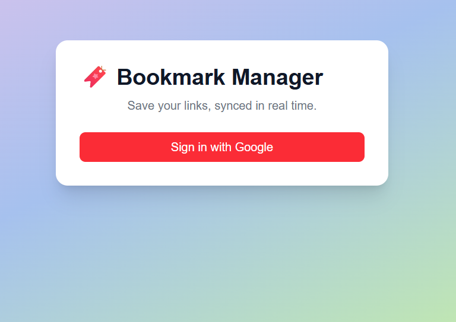
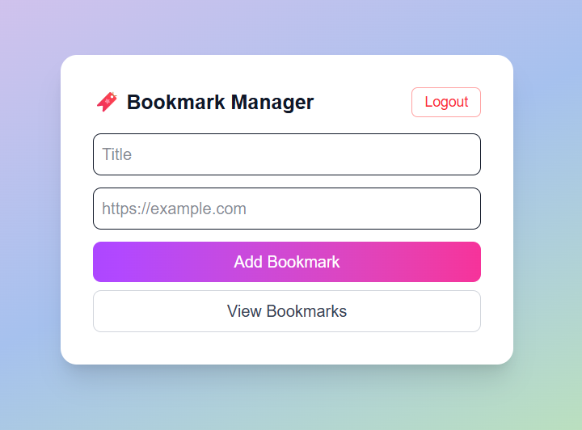
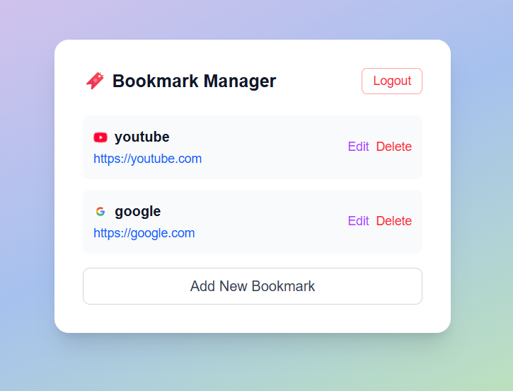

## Bookmark App 🔖

A simple, interactive **Bookmark App** to save, view, and manage your favorite links efficiently. Supports **Google login**, real-time updates, and user-specific bookmarks using Supabase.

---

## About

- This app allows users to:

  - Add bookmarks with titles and URLs

  - View saved bookmarks in a list

  - Edit or delete bookmarks

  - Keep bookmarks persistent across sessions using Supabase

  - Sync changes in real-time across tabs

  - Ensure each user sees only their own bookmarks (RLS Security)

  - Built for learning purposes, but can be extended for personal or production use.

---

## Features
- **Add Bookmark**: Save a new link with a title  
- **Edit Bookmark**: Update existing bookmarks  
- **Delete Bookmark**: Remove bookmarks you don’t need  
- **User Authentication**: Sign in with Google  
- **Persistent Storage**: Data is stored in Supabase and persists across refreshes  
- **Realtime Updates**: Changes in one tab instantly appear in another  
- **RLS Security**: Each user sees only their own bookmarks  
- **Single Tab Flow**: Add, view, edit, and delete bookmarks all in one tab  

---

## Tech Stack
- **Frontend**: React.js,Next.js 
- **Backend / Database**: Supabase (PostgreSQL + RLS)  
- **Deployment**: Vercel  
- **Styling**: Tailwind CSS  

---

## Installation
1. Clone the repository
git clone https://github.com/nehakoyalkar18/bookmark-app.git
cd bookmark-app

2. Install dependencies
   - npm install

3. Setup environment variables

   - Create a .env.local file in the root folder and add your Supabase credentials:

   - REACT_APP_SUPABASE_URL=your_supabase_url
   - REACT_APP_SUPABASE_ANON_KEY=your_supabase_anon_key
   - ⚠️ Note: Do not commit .env.local as it contains sensitive information.

4. Start the development server
   - npm start

5. Open the app

   - Your app should now run at: http://localhost:3000

---

## Usage
- Open the app in your browser.

- Sign in with Google.

- Add bookmarks on the main page.

- Click View Bookmarks to see your list.

- Edit or delete bookmarks as needed.

- Click Add New Bookmark to go back to adding more bookmarks.

- Changes are synced in real-time across multiple tabs.

---

## Screenshots
### signin page :

### Add Bookmark Page :

### View Bookmarks Page:

- Replace the images in assets/ with your own screenshots.

---

## Problems & Solutions
1. Google Auth

   **Problem**: First time working with Google Auth, had to learn how to implement it.

   **Solution**: Studied Supabase OAuth docs and implemented onAuthStateChange to manage sessions properly.

2. Delete Function Failing

   **Problem**: 
        - Using supabase.auth.getUser() fetched the user once but didn’t keep the session in sync.
        - DELETE requests failed silently due to RLS blocking anon users.
        - Mixing auth logic and realtime caused inconsistencies; UI was manually updating state instead of relying on DB.
        - Too many moving parts at once caused bugs.

   **Solution**:

        - Use onAuthStateChange as single source of truth for auth

        - Let Supabase control session and handle real-time updates

        - Fetch data from DB to drive UI instead of manual hacks

3. Syntax Errors While Loading

   **Problem**: Minor syntax errors caused UI breaks during development.

   **Solution**: Carefully debugged, fixed imports and state handling.

4. Text Visibility in Different Themes

   **Problem**: When the app was viewed in light mode, some text was too dark; in dark mode, some text was barely visible.

   **Solution**: Updated CSS and Tailwind classes to ensure text colors adapt properly to backgrounds, making the app readable in both light and dark modes